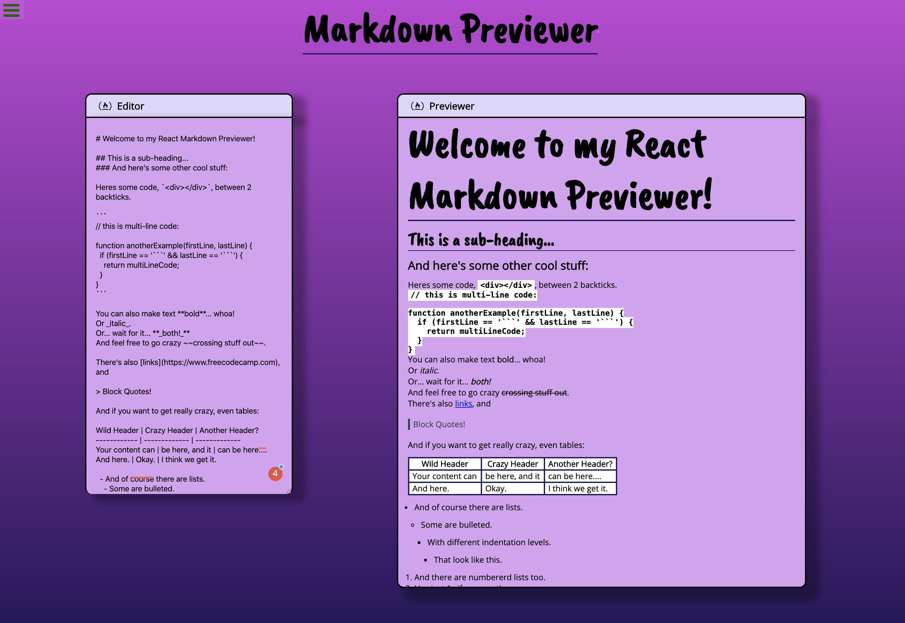

# Markdown-Previewer-FCC
### FreeCodeCamp Front End Library Project: Markdown Previewer
This project was bootstrapped with [Create React App](https://github.com/facebook/create-react-app)

## Project Technology
- HTML5
- CSS3 
- JavaScript
- React JS

## Demo of App
You can view my app [here](https://tlanetterose.github.io/TLP-Markdown-Previewer-FCC/)

## Project Thoughts
I enjoy using React JS to design web apps. When I started this project, I had huge ideas about how I wanted set up my app. After some research and really focusing on the project guidelines, my goals became more realistic. 

## Attribution
[React Markdown Previewer](https://medium.com/@marko.libor/react-markdown-previewer-64fa8d9896c0) article by Libor Marko 
- I used this article as a guide and studied his GitHub Repository. 
 
## Picture of App

